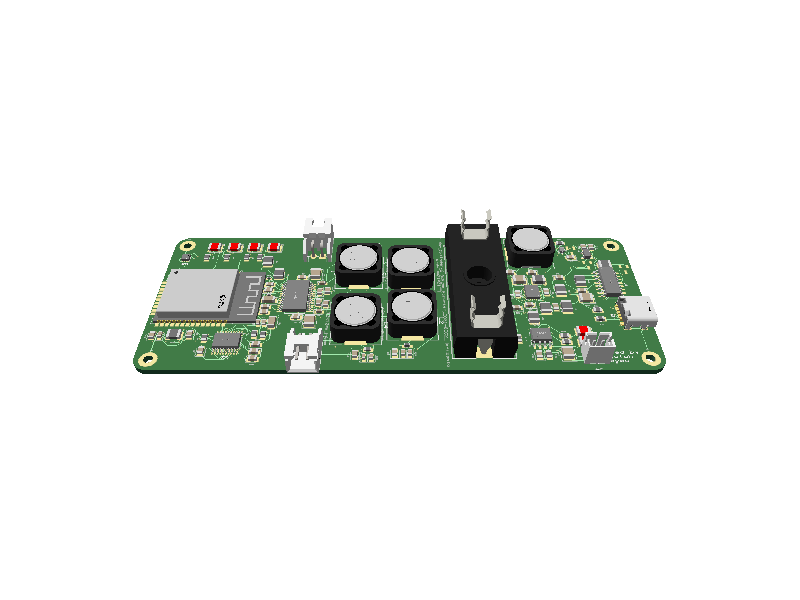

# ESP32 HiFi Bluetooth Speaker PCB

A complete, battery-powered stereo Bluetooth speaker board built around the
`ESP32-WROOM-32`, a `PCM5100A` audio DAC, and a `TPA3116D2` Class-D amplifier.
The board combines Bluetooth control, digital audio conversion, speaker power,
USB-C programming, Li-ion charging, battery monitoring, and power conversion on
one four-layer PCB.



The hardware is implemented as a native [tscircuit](https://tscircuit.com/)
project. The repository includes the complete circuit source, exact imported
packages for the major ICs and connectors, and generated PCB, schematic, and 3D
snapshots.

## Highlights

- ESP32-WROOM-32 module for Bluetooth, audio control, and application firmware
- PCM5100A stereo DAC connected directly to the ESP32 over I2S
- TPA3116D2 stereo Class-D amplifier with differential LC output filters
- Two locking JST XH speaker connectors for separate left and right channels
- USB-C power and programming through an onboard CH340C USB-to-UART bridge
- Automatic ESP32 boot/reset control from the CH340C DTR and RTS signals
- TP4056 single-cell Li-ion charger with charge and standby indicators
- MAX17048 battery fuel gauge connected to the ESP32 over I2C
- XC6220 3.3 V regulator for the digital and analog low-voltage sections
- TPS61088 boost converter generating the amplifier's nominal 12 V rail
- Four-layer, 125.78 x 48.0208 mm FR4 PCB with four mounting positions

## System architecture

```text
                         +--> CH340C USB-UART --> ESP32 programming/debug
USB-C (J3) -------------+
                         +--> TP4056 charger --> Li-ion battery (J4)
                                                  |
                                                  +--> MAX17048 fuel gauge
                                                  |
                         USB/battery power path --+
                                  |               |
                                  |               +--> TPS61088 boost --> 12 V
                                  |                                      |
                                  +--> XC6220 LDO --> 3.3 V              v
                                                       ESP32 --> PCM5100A --> TPA3116D2
                                                                  I2S       Class-D amp
                                                                                |
                                                                        LC output filters
                                                                                |
                                                                  J1 right / J2 left speaker
```

## Functional blocks

| Block | Main parts | Purpose |
| --- | --- | --- |
| Bluetooth controller | U3 `ESP32-WROOM-32-N4` | Runs the Bluetooth audio application and supplies the I2S audio stream |
| Stereo audio DAC | U2 `PCM5100APWR` | Converts ESP32 I2S audio into left and right analog signals |
| Class-D amplifier | U1 `TPA3116D2DAD` | Drives two passive speakers from the boosted amplifier rail |
| Output filters | L1-L4 and C11-C22 | Filters the four bridge-tied Class-D outputs before the speaker connectors |
| USB interface | J3 `TYPE-C-31-M-12` | Provides USB 2.0 data and 5 V input |
| USB-to-UART | U4 `CH340C`, Q1, Q2 | Programs the ESP32 and controls automatic boot/reset |
| Li-ion charger | U6 `TP4056-42-ESOP8` | Charges the connected single-cell battery from USB power |
| Battery connector | J4 `B2B-PH-K-S` | Connects the external single-cell Li-ion battery |
| 3.3 V regulator | U5 `XC6220B331MR` | Powers the ESP32, DAC, USB-UART bridge, and low-voltage circuitry |
| 12 V boost converter | U7 `TPS61088RHLR`, L5, F1 | Generates the nominal 12 V amplifier supply from the battery rail |
| Fuel gauge | U8 `MAX17048G+T10` | Measures battery state over I2C |
| Status indication | D2-D7 | Shows charger state and provides four ESP32-controlled indicators |

## Audio path

The ESP32 sends a three-wire I2S stream to the PCM5100A. The DAC's analog left
and right outputs pass through reconstruction filtering and AC-coupling before
reaching the differential inputs of the TPA3116D2. Each amplifier half-bridge
then passes through a 10 uH LC output filter before reaching its speaker
connector.

| Signal | ESP32 pin | Destination |
| --- | ---: | --- |
| I2S left/right clock | GPIO25 | U2 `LRCK` |
| I2S bit clock | GPIO26 | U2 `BCK` |
| I2S audio data | GPIO19 | U2 `DIN` |
| Fuel-gauge clock | GPIO21 | U8 `SCL` |
| Fuel-gauge data | GPIO22 | U8 `SDA` |
| UART receive/transmit | RXD0 / TXD0 | U4 CH340C |
| User indicators | GPIO4, GPIO16, GPIO17, GPIO5 | D4-D7 |

The repository contains the board hardware only. ESP32 firmware, Bluetooth
profiles, audio buffering, volume control, and battery-management software must
be supplied by the application.

## Connectors and pinout

| Connector | Pin | Signal | Notes |
| --- | ---: | --- | --- |
| J1 | 1 | Filtered `OUTPR` | Right-speaker bridge output |
| J1 | 2 | Filtered `OUTNR` | Right-speaker bridge output |
| J2 | 1 | Filtered `OUTPL` | Left-speaker bridge output |
| J2 | 2 | Filtered `OUTNL` | Left-speaker bridge output |
| J3 | - | USB-C | 5 V input, USB data, and ESP32 programming |
| J4 | 1 | GND | Battery negative |
| J4 | 2 | `V_BATT` | Battery positive |

> [!WARNING]
> J1 and J2 are bridge-tied speaker outputs. Neither speaker wire is ground.
> Connect each passive speaker only across the two pins of its own connector;
> never tie an output to ground or combine the left and right outputs.

## Power architecture

USB-C VBUS supplies the charger and participates in the low-voltage power path.
U6 charges the battery attached to J4, while D2 and D3 indicate charging and
standby states. The Q3/D1 MOSFET-Schottky network allows the 3.3 V regulator input
to be supplied from USB or the battery without directly shorting the two sources.

U5 generates the `P3_3V` rail used by the ESP32, PCM5100A, CH340C, and supporting
logic. The battery rail also feeds U7 through F1 and L5. U7 boosts it to the
`P12V` rail used by the TPA3116D2 amplifier and its output stage.

Before powering assembled hardware:

- Use a protected single-cell Li-ion/LiPo battery with the correct J4 polarity.
- Confirm the TP4056 charge-current configuration is suitable for the battery.
- Start from a current-limited supply and monitor the charger, boost converter,
  regulator, and amplifier temperatures.
- Verify speaker impedance, output-filter component ratings, and peak battery
  current for the intended listening level.

## PCB and mechanical details

| Property | Value |
| --- | --- |
| Board size | 125.78 x 48.0208 mm |
| Layer count | 4 copper layers |
| Thickness | 1.58 mm |
| Material | FR4 |
| Solder mask | Green |
| Corner radius | 3.96 mm |
| Mounting positions | 4 x 2.2 mm plated holes with 4.4 mm pads |
| Source components | 115 declarations: 111 electrical parts and 4 mounting pads |
| Schematic organization | 10 functional sheets |

The complete generated views are available here:

- [PCB layout](__snapshots__/index.circuit-pcb.snap.svg)
- [Schematic](__snapshots__/index.circuit-schematic.snap.svg)
- [3D board render](__snapshots__/index.circuit-3d.snap.png)

## tscircuit source structure

`index.circuit.tsx` contains the board outline, ten schematic sheets, component
values, schematic placement, PCB placement, and all electrical connections as
direct JSX. Native tscircuit primitives are used for passives, LEDs,
transistors, the MOSFET, Schottky diode, fuse, and mounting pads.

The `imports/` directory contains only the eight major IC packages and the exact
USB-C/JST connectors that need custom geometry. Each imported component carries
its manufacturer part number, JLCPCB/LCSC reference, exact footprint, and remote
OBJ/STEP model. The five large inductors and the fuse holder use KiCad-library
footprints directly.

```text
.
├── index.circuit.tsx       # Complete board and schematic source
├── imports/                # Exact IC and connector packages
├── __snapshots__/          # Checked-in PCB, schematic, and 3D views
├── package.json            # Development and build commands
├── tscircuit.config.json   # tscircuit CLI configuration
└── tsconfig.json           # TypeScript configuration
```

No generated component table, runtime Circuit JSON import, KiCad converter, or
source-generation script is required to render the design.

## Build and development

[Bun](https://bun.sh/) is the recommended package manager because the lockfile
is checked into the repository.

```bash
bun install
bun run typecheck
bun run dev
bun run build
bun run snapshot
```

- `bun run dev` opens the interactive PCB, schematic, and 3D viewer.
- `bun run build` compiles every circuit entry and writes Circuit JSON under
  `dist/`.
- `bun run snapshot` compares the generated 3D render with the checked-in
  snapshot.
- Use `bun run snapshot:update` only when a visual change is intentional.

Generate the complete manufacturing-review artifact set with:

```bash
bunx tsci build index.circuit.tsx --pcb-png --schematic-png --svgs --3d-png --step
```

A clean first build needs network access to resolve the `kicad:` library
footprints, supplier metadata, and remote 3D models.

Additional electrical and layout checks can be run after building:

```bash
bunx tsci check netlist
bunx tsci check schematic-placement
bunx tsci check placement
bunx tsci check routing-difficulty
bunx tsci check shorts --mode pcb dist/index/circuit.json
```

## Manufacturing status

This repository is an engineering and reconstruction project, not an
unconditional production-release package. Automatic placement DRC is enabled.
The board explicitly permits via-in-pad because U7 uses eight grounded thermal
vias in its exposed PGND pad.

The current source passes TypeScript compilation and the tscircuit netlist,
schematic-placement, placement, and PCB-shorts checks. Netlist and placement DRC
both report zero errors and zero warnings, the schematic-placement report has no
issue block, and the fresh autoroute completes 260 routed traces with no jumpers.
The generated Circuit JSON contains zero `*_error` records, and the bitmap-based
PCB check reports no shorts.

With tscircuit 0.0.2297, `tsci check routing-difficulty` does not complete in a
practical time for this 341-connection design and produces no analysis output;
it is therefore not recorded as a passing check. This tooling limitation does
not replace electrical review, DFM, thermal analysis, antenna/EMI validation, or
a physical prototype test.

Before ordering boards, verify every footprint and connector orientation against
the current manufacturer datasheet, review the four-layer stackup and high-current
paths, check the ESP32 antenna area, and have the assembly house perform a DFM
review. Bring up the first unit with current limiting and dummy speaker loads.
